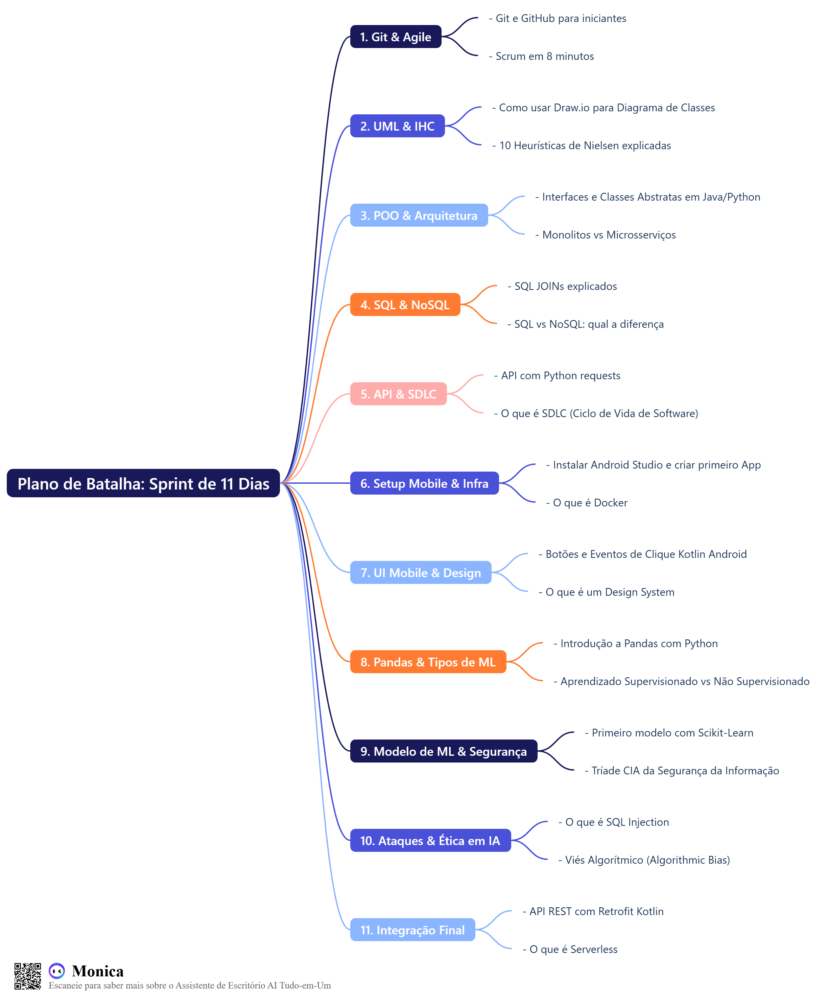

# 🚀 My Developer Journey

## 🎯 Sobre este Repositório

Este repositório é o meu laboratório de código e diário de aprendizado. Ele documenta minha jornada contínua de estudos e prática em Ciência da Computação, servindo como um portfólio vivo do meu progresso.

O projeto foi iniciado como um **Sprint de Preparação de 11 Dias** para o 5º período da faculdade, focando em solidificar e conectar conceitos-chave de:

*   Desenvolvimento Mobile
*   Aplicações em Machine Learning
*   Segurança da Informação
*   Engenharia de Software

## 🗺️ Estrutura e Roteiro de Estudos

O repositório está organizado em módulos de conhecimento. Cada pasta representa um tópico fundamental e contém os artefatos práticos (códigos, diagramas) e um `learning_log.md` com minhas anotações e as fontes de estudo utilizadas.

Abaixo está o mapa mental visual que estrutura este sprint de 11 dias.

  
<strong>Click here for the detailed day-by-day Battle Plan</strong>

  ### Dia 1: Ferramentas e Mentalidade Ágil
  - **Foco Prático (Ação):** Busca no YouTube: "Git e GitHub para iniciantes"
  - **Foco Teórico (Contexto):** Busca no YouTube: "Scrum em 8 minutos"

  ### Dia 2: Modelagem e Experiência do Usuário (IHC)
  - **Foco Prático (Ação):** Busca no YouTube: "Como usar Draw.io para Diagrama de Classes UML"
  - **Foco Teórico (Contexto):** Busca no YouTube: "10 Heurísticas de Nielsen explicadas"

  ### Dia 3: POO e Arquitetura de Software
  - **Foco Prático (Ação):** Busca no YouTube: "Interfaces e Classes Abstratas em Java (ou Python)"
  - **Foco Teórico (Contexto):** Busca no YouTube: "Monolitos vs Microsserviços em 5 minutos"

  ### Dia 4: Banco de Dados Relacional e o Mundo Além
  - **Foco Prático (Ação):** Busca no YouTube: "SQL JOINs explicados (INNER, LEFT JOIN)"
  - **Foco Teórico (Contexto):** Busca no YouTube: "SQL vs NoSQL qual a diferença?"

  ### Dia 5: APIs e Ciclo de Vida do Software
  - **Foco Prático (Ação):** Busca no YouTube: "O que é uma API REST?" e "Como consumir API com Python requests"
  - **Foco Teórico (Contexto):** Busca no YouTube: "O que é SDLC (Ciclo de Vida de Desenvolvimento de Software)?"

  ### Dia 6: Setup Mobile e a Infraestrutura Moderna
  - **Foco Prático (Ação):** Busca no YouTube: "Como instalar Android Studio e criar seu primeiro App Kotlin 2024"
  - **Foco Teórico (Contexto):** Busca no YouTube: "O que é Docker? Explicado de forma simples"

  ### Dia 7: Interatividade Mobile e Design de Interfaces
  - **Foco Prático (Ação):** Busca no YouTube: "Botões e Eventos de Clique (onClick) em Kotlin Android Studio"
  - **Foco Teórico (Contexto):** Busca no YouTube: "O que é um Design System?"

  ### Dia 8: Manipulação de Dados e o Fundamento de ML
  - **Foco Prático (Ação):** Busca no YouTube: "Introdução a Pandas com Python para Análise de Dados"
  - **Foco Teórico (Contexto):** Busca no YouTube: "Aprendizado Supervisionado vs Não Supervisionado"

  ### Dia 9: Modelagem Preditiva e a Base da Segurança
  - **Foco Prático (Ação):** Busca no YouTube: "Seu primeiro modelo de Machine Learning com Scikit-Learn"
  - **Foco Teórico (Contexto):** Busca no YouTube: "Tríade CIA da Segurança da Informação"

  ### Dia 10: Segurança na Prática e a Ética em IA
  - **Foco Prático (Ação):** Busca no YouTube: "O que é SQL Injection? Como funciona e como evitar"
  - **Foco Teórico (Contexto):** Busca no YouTube: "Viés Algorítmico (Algorithmic Bias) o que é?"

  ### Dia 11 (Bônus): O Desafio da Conexão Final
  - **Foco Prático (Ação):** Busca no YouTube: "Consumir API REST em App Android Kotlin com Retrofit"
  - **Foco Teórico (Contexto):** Busca no YouTube: "O que é Serverless?"

---

1.  [**Version Control & Agile**](./01_Version-Control-and-Agile/)
2.  [**Software Modeling**](./02_Software-Modeling/)
3.  [**Programming Paradigms**](./03_Programming-Paradigms/)
4.  [**Data Management**](./04_Data-Management/)
5.  [**API & System Lifecycle**](./05_API-and-System-Lifecycle/)
6.  [**Mobile & Infrastructure**](./06_Mobile-and-Infrastructure/)
7.  [**Mobile UI & Design Systems**](./07_Mobile-UI-and-Design-Systems/)
8.  [**Data Science Foundations**](./08_Data-Science-Foundations/)
9.  [**Machine Learning Models**](./09_Machine-Learning-Models/)
10. [**Security & Ethics**](./10_Security-and-Ethics/)
11. [**Full-Stack Integration**](./11_Full-Stack-Integration/)

## 🛠️ Ferramentas e Tecnologias

Esta é a stack de tecnologias e ferramentas exploradas neste projeto:

*   🐙 **Versionamento:** Git, GitHub, GitHub Desktop
*   🐍 **Linguagens:** Python, Kotlin, Java, SQL
*   🤖 **Desenvolvimento Mobile:** Android Studio
*   📊 **Análise de Dados:** Pandas, Jupyter Notebook, Scikit-Learn
*   🎨 **Modelagem e Design:** Draw.io
*   🗃️ **Banco de Dados:** SQLite

## 🧠 Meu Processo de Aprendizagem

Para cada tópico, sigo um ciclo disciplinado:
1.  **Ação:** Assisto a um vídeo prático e construo o artefato do dia (código, diagrama, etc.).
2.  **Contexto:** Assisto a um vídeo teórico para entender o "porquê" por trás da prática.
3.  **Documentação:** Registro minhas fontes, aprendizados e desafios no arquivo `learning_log.md` correspondente.
4.  **Versionamento:** Faço o commit do progresso do dia com uma mensagem clara e descritiva.

## 📬 Contato

<!-- Substitua pelo seu nome e links! -->
Feito com ❤️ por **Felipe Rodrigues**. Vamos nos conectar!

